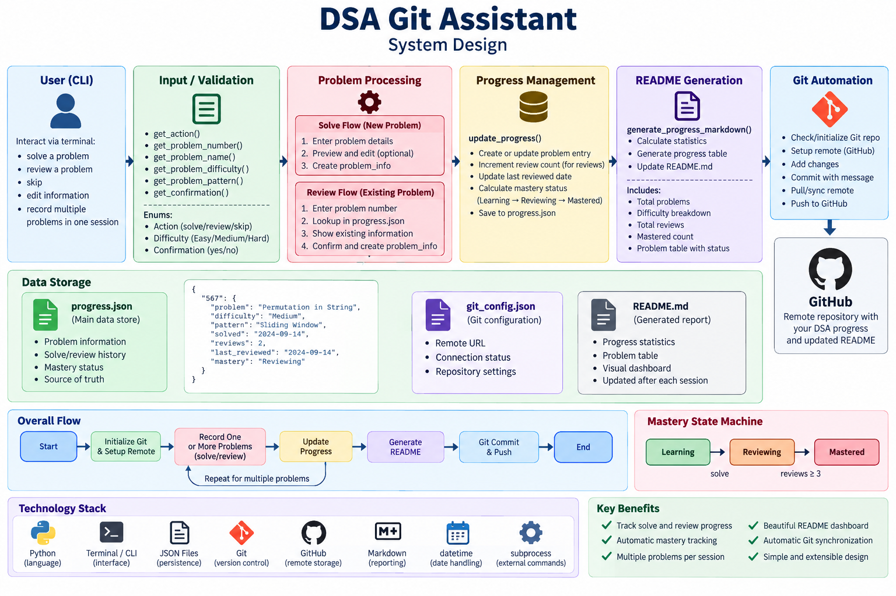

# DSA Interview Preparation

A structured Data Structures & Algorithms practice log, paired with **DSA Git Assistant** — a CLI tool I built to automate tracking, spaced-repetition-style review, and version control for daily problem-solving practice.

## Goals

- Build strong pattern recognition
- Practice LeetCode consistently
- Review previously solved problems
- Improve problem-solving speed
- Prepare for technical interviews

---

## DSA Git Assistant

`push.py` is a Python CLI that turns "I solved a problem" into a fully tracked, committed, and pushed unit of progress — no manual bookkeeping required. It's included here as a small, self-contained system design walkthrough: a single-user CLI tool with persistent state, idempotent data updates, and safe synchronization against a remote system it doesn't fully control (GitHub).

### System Design



### Architecture Overview

| Component | Responsibility |
|---|---|
| **CLI / Input Layer** | Prompts the user for problem data, validates input via `Enum`-backed types (`Difficulty`, `Action`, `Confirmation`), and supports in-place edits before committing to state. |
| **Persistence Layer** | `progress.json` stores one record per problem (difficulty, pattern, review count, mastery level). `git_config.json` caches the remote URL so it can be restored if the local Git config is ever lost. |
| **Sync Layer** | Detects whether a Git repo/remote already exists, restores it from cache if missing, and pulls (`--allow-unrelated-histories`) before pushing to avoid divergent-history failures. |
| **Reporting Layer** | Regenerates the `## Progress` section of this README from `progress.json` on every run, computing stats (counts by difficulty, review totals, mastery breakdown) and a sorted problem table. |
| **Version Control Layer** | Stages, commits, and pushes — creating the upstream branch on first push, using the existing tracking branch afterward. |

### Key Design Decisions

- **Idempotent state updates** — Recording a `solve` on an already-solved problem number updates its metadata without clobbering the original `solved` date; recording a `review` increments a counter rather than overwriting history. This makes the tool safe to run repeatedly without corrupting progress data.
- **Enum-driven validation** — User actions (`solve` / `review` / `skip`) and difficulty levels are backed by `Enum` classes instead of raw strings, so invalid input is rejected at the boundary rather than silently stored.
- **Config with fallback recovery** — The GitHub remote is resolved in priority order: live Git config → cached `git_config.json` → interactive prompt. This means a fresh clone or a corrupted `.git` directory doesn't require the user to remember their own remote URL.
- **Generated vs. hand-written content** — The README is split into static sections (goals, topics) and a generated block delimited by `<!-- PROGRESS_START -->` / `<!-- PROGRESS_END -->` markers, so automation and manual edits never conflict.
- **Defensive sync before push** — Pulling with `--allow-unrelated-histories` before pushing handles the common case of a GitHub repo created with an initial commit (e.g., a README or license) that the local repo doesn't share history with.

### Tech Stack

- **Language:** Python 3 (standard library only — `json`, `subprocess`, `enum`, `datetime`)
- **Version Control:** Git + GitHub, driven via `subprocess`
- **Storage:** Flat-file JSON (no database — appropriate for single-user, low-write-volume state)

### Possible Extensions

Discussion points for taking this further in a system design context:

- Swap `progress.json` for SQLite to support querying/filtering at scale without loading the full file into memory.
- Add a spaced-repetition scheduler (e.g., SM-2) to recommend *which* problem to review next, instead of tracking review counts alone.
- Extract Git operations behind an interface to support non-GitHub remotes or a dry-run/offline mode.
- Add concurrency handling (file locking) if the tool were ever used to record from multiple sessions in parallel.

### Usage

```bash
python push.py
```

The script will:
1. Initialize Git and verify/restore the GitHub remote if needed.
2. Prompt for one or more problems solved or reviewed.
3. Update `progress.json` and regenerate the README's progress table.
4. Commit and push the changes.

---

## Progress

<!-- PROGRESS_START -->

### Statistics

- Problems completed: **26**
- Easy: **9**
- Medium: **14**
- Hard: **2**
- Total reviews: **8**
- Mastered: **0**

### Problem Log

| # | Problem | Difficulty | Pattern | Solved | Reviews | Last Review | Mastery |
|---|---|---|---|---|---:|---|---|
| 1 | Two Sum | Easy | Index/Value Handlin;Bridge To Hash Maps | 2026-08-25 | 1 | 2026-08-26 |  Reviewing |
| 2 | Best Time to Buy and Sell Stock | Easy | One-Pass / Running Minimum /Array | 2026-08-25 | 1 | 2026-08-26 |  Reviewing |
| 3 | Best Time to Buy and Sell Stock II | Medium | Array/Dynamic Programming | 2026-08-25 | 1 | 2026-08-31 |  Reviewing |
| 4 | Remove Duplicates from Sorted Array | Easy | Two Pointers | 2026-08-26 | 1 | 2026-08-31 |  Reviewing |
| 5 | Product of Array Except Self | Medium | Prefix Sum/Array | 2026-08-27 | 0 | - |  Learning |
| 6 | Maximum Subarray | Medium | Array/Running State/Kadane/ | 2026-08-27 | 0 | - |  Learning |
| 7 | Spiral Matrix | Medium | Array /Matrix/Boundary Simulation | 2026-08-28 | 0 | - |  Learning |
| 8 | Subarray Sum Equals K | Medium | Array, Hash Table Prefix Sum | 2026-09-01 | 0 | - |  Learning |
| 9 | Contain Duplicate | Easy | Set Membership | 2026-09-01 | 0 | - |  Learning |
| 10 | Valid Anagram | Easy | Frequency Counting | 2026-09-01 | 0 | - |  Learning |
| 11 | Group Anagrams | Medium | Canonical Key/Grouping | 2026-09-02 | 0 | - |  Learning |
| 12 | Longest Consecutive Sequence | Medium | Set-Based Sequence Starts | 2026-09-02 | 0 | - |  Learning |
| 13 | Insert Delete GetRandom O(1) | Medium | Map/Dynamic Array Design | 2026-09-03 | 1 | 2026-09-03 |  Reviewing |
| 14 | Valid Palindrome | Easy | Opposite Ends | 2026-09-03 | 0 | - |  Learning |
| 15 | Valid Palindrome II | Easy | Opposite Ends | 2026-09-03 | 0 | - |  Learning |
| 16 | Two Sum II - Input Array Is Sorted | Medium | Sorted Two Pointers | 2026-09-04 | 0 | - |  Learning |
| 17 | Container With Most Water | Medium | Movement Invariant | 2026-09-04 | 0 | - |  Learning |
| 18 | 3Sum | Medium | Sort/Fixed Index/Two Pointers | 2026-09-05 | 0 | - |  Learning |
| 19 | Trapping Rain Water | Hard | Two-End State/Maxima | 2026-09-05 | 0 | - |  Learning |
| 20 | Maximum Average Subarray I | Easy | Sliding Window | 2026-09-05 | 0 | - |  Learning |
| 21 | Longest Substring Without Repeating Characters | Medium | Hash Table/ Sliding Window | 2026-09-06 | 1 | 2026-09-14 |  Reviewing |
| 22 | Minimum Size Subarray Sum | Medium | Sliding Window | 2026-09-07 | 1 | 2026-09-14 |  Reviewing |
| 23 | Longest Repeating Character Replacement | Meduim | Window Invariant | 2026-09-09 | 0 | - |  Learning |
| 24 | Permutation in String | Medium | Frequency Window | 2026-09-13 | 1 | 2026-09-15 |  Reviewing |
| 25 | Minimum Window Substring | Hard | Minimum Covering Window | 2026-09-15 | 0 | - |  Learning |
| 26 | Valid Parentheses | Easy | Stack | 2026-09-21 | 0 | - |  Learning |

<!-- PROGRESS_END -->

## Topics

- Arrays
- HashMaps
- Two Pointers
- Sliding Window
- Stacks
- Queues
- Linked Lists
- Binary Search
- Trees
- Heaps
- Graphs
- Backtracking
- Tries
- Union Find
- Greedy
- Dynamic Programming
